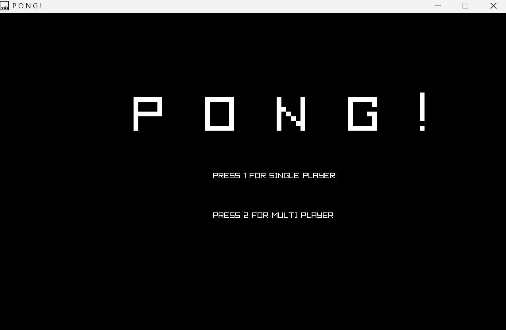
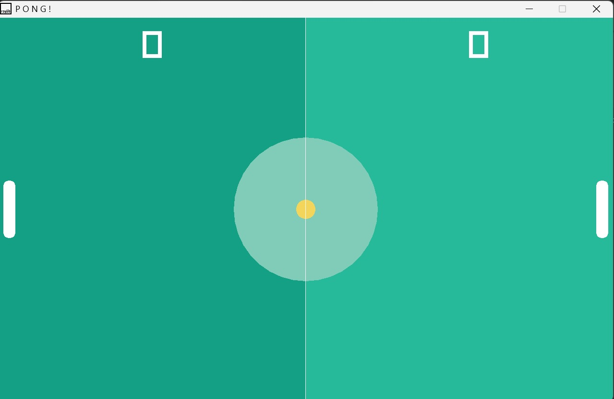

# PONG GAME

Its a very interactive game in which you have to hit the balll with a paddle. Made using c++ and Ray-Lib. Ray-Lib is very versatile game library to create 2D game very efficiently. This program is also a very good example of ray-lib game.

## Features

    1. Single and Multi Player modes.
    2. Effective score system.
    3. Used AI for Single player mode.
    
## How to Play!

    1. SINGLE PLAYER MODE
        --> use UP and DOWN arrow key to control the paddle.
    2. MULTI PLAYER MODE
        --> player 1 will use UP and DOWN arrow key.
        --> player 2 will use (W - UP) and (S - DOWN) key. 
    3. When the ball hits the opponent's wall you will be awarded one point and vice-versa.
    4. If someone score 5 points he/she will win the match.
## Installation
Download this code and run the main.exe file in your system.
    
## Screenshots

